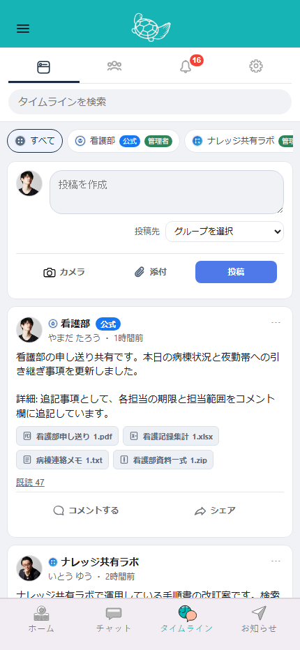
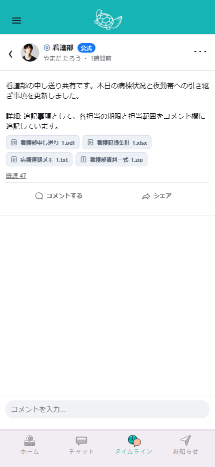
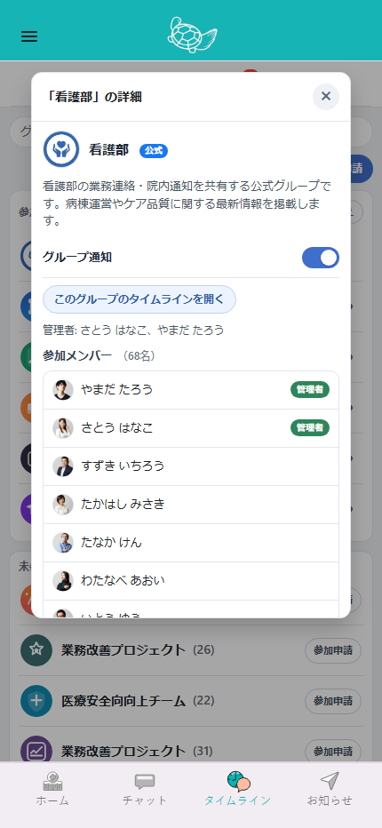
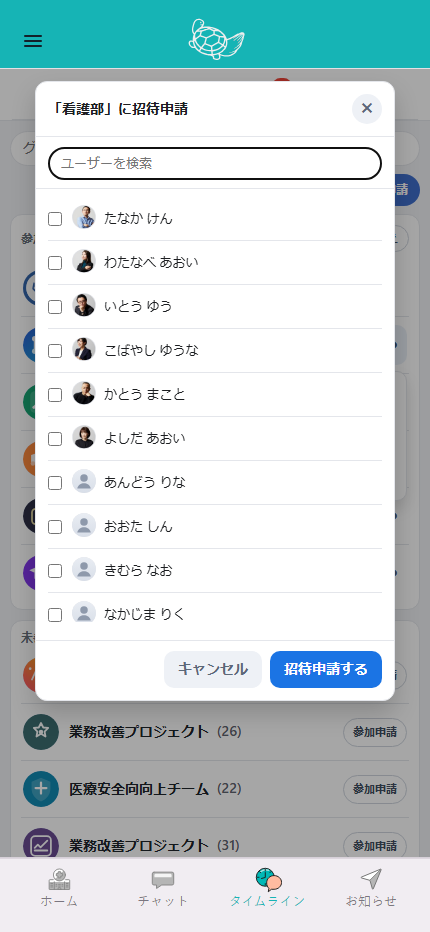
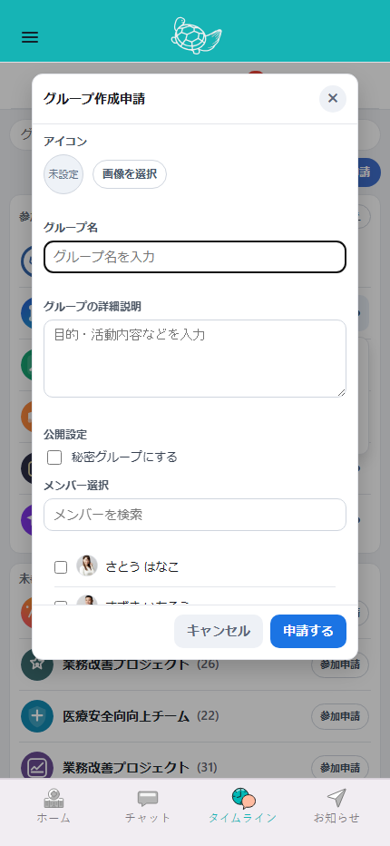
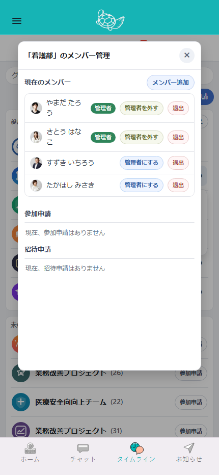
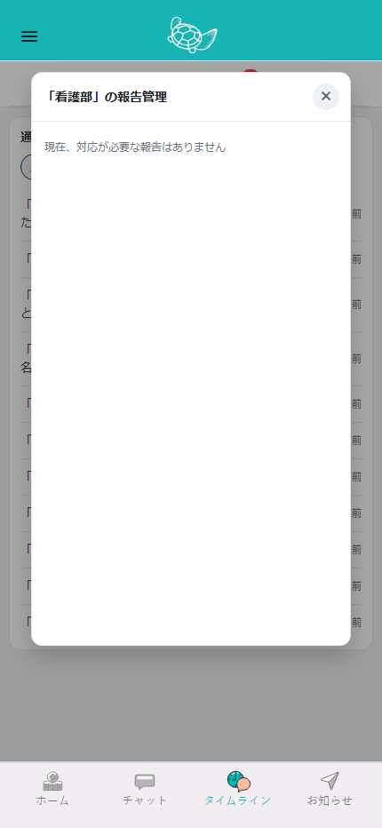
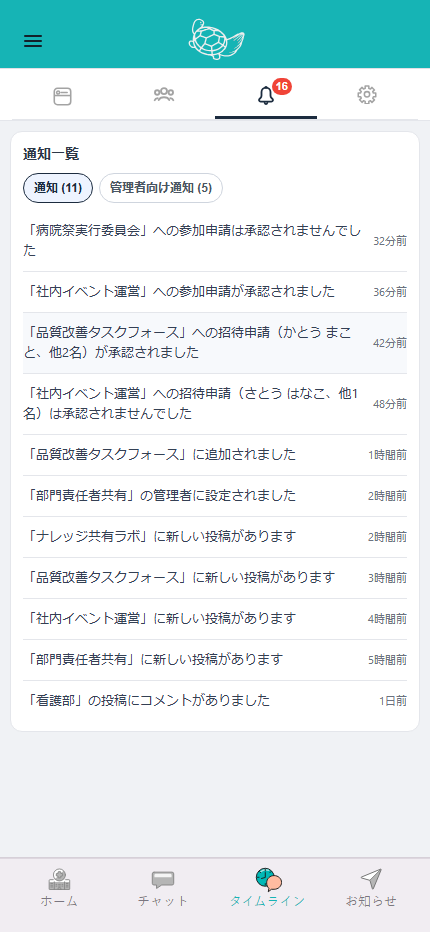
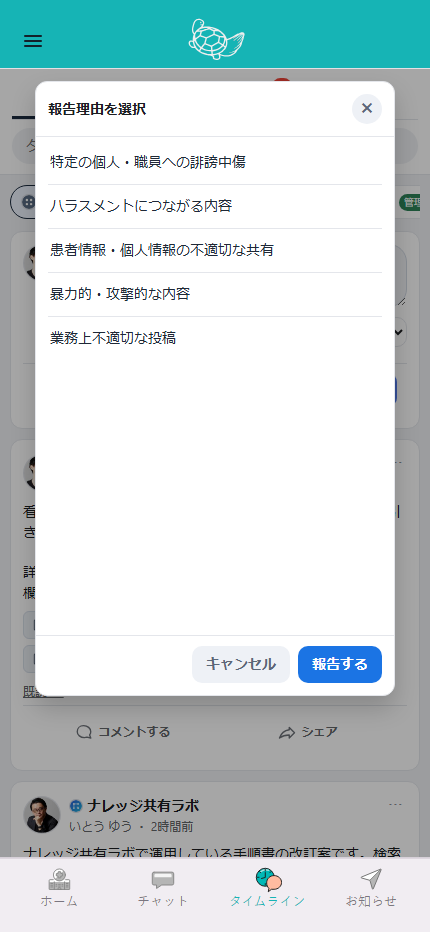

# Mock Clickable Inventory

`src/moock-timeline.html` 実装ベースの「押せる箇所」一覧。

関連スクリーンショット:

- ギャラリー: [docs/mock-flow-gallery.md](/c:/Users/佐々木史/Documents/workspace/sandbox/docs/mock-flow-gallery.md)
- 画像フォルダ: [docs/screenshots](/c:/Users/佐々木史/Documents/workspace/sandbox/docs/screenshots)

対象:

- ボタン
- リンク風 UI
- 行クリック
- モーダルの閉じる導線
- メニュー項目
- 長押し起点

対象外:

- 単なるテキスト入力
- スクロール
- ドラッグ以外の非クリック操作

## 1. 常設ナビゲーション

### 上部メニュー

- `.top-menu-item`
  - 0: タイムライン表示
  - 1: グループ表示
  - 2: 通知表示
  - 3: 設定表示

### タイムライン内フィードタブ

- `[data-feed-id]`
  - 対象グループのフィードへ切替

### 検索まわり

- `#timeline-search-clear`
  - タイムライン検索入力をクリア
- `#group-search`
  - グループ一覧の絞り込み
- `#notifications-tab-general`
  - 通知タブへ切替
- `#notifications-tab-admin`
  - 管理者向け通知タブへ切替

## 2. 投稿カード

参考スクショ:

### 投稿本文/メディア

- `.post-media-item[data-preview-post-id][data-preview-index]`
  - 投稿メディアのプレビューを開く
- `.shared-post-media-item[data-shared-preview-post-id][data-shared-preview-index]`
  - シェア元投稿のメディアプレビューを開く
- `.more-inline`
  - 折りたたみ本文を全文表示

### 投稿メニュー

- `.menu-btn[data-menu-id]`
  - 投稿メニューの開閉
- `.report-action[data-report-id]`
  - 報告理由モーダルを開く
- `.edit-post-action[data-edit-post-id]`
  - 投稿編集ダイアログを開く
  - 条件: 自分の投稿
- `.delete-post-action[data-delete-post-id]`
  - 投稿削除確認を開く
  - 条件: 自分の投稿 or 投稿管理権限あり

### エンゲージメント

- `.read-count-btn`
  - 既読者モーダルを開く
- `.comment-count-link[data-post-id]`
  - コメントビューを開く
- `.share-count-link[data-post-id]`
  - シェア投稿ダイアログを開く
- `.comment-action[data-post-id]`
  - コメントビューを開く
- `.share-action[data-post-id]`
  - シェア投稿ダイアログを開く

## 3. 投稿作成エリア

### 添付/投稿

- `#composer-attach-btn`
  - ファイル選択を開く
- `#composer-camera-btn`
  - カメラ/画像選択を開く
- `[data-attach-id]`
  - 添付プレビューの削除
- `#composer-post-btn`
  - 投稿する

### 投稿先/補助

- `#composer-target`
  - 投稿先グループ選択
- `#composer-input`
  - URL 入力時のリンクプレビュー更新

## 4. コメントビュー

参考スクショ:

### コメントビュー本体

- `#comment-back`
  - コメントビューを閉じる
- `#comment-send`
  - コメント送信
- `.comment-item[data-comment-index]`
  - 長押し対象
- コメントビュー左端スワイプ
  - コメントビューを閉じる

### コメントヘッダーメニュー

- `#comment-header-menu`
  - ヘッダーメニュー開閉
- `.comment-header-report-post`
  - 投稿通報
- `.comment-header-edit-post`
  - 投稿編集
  - 条件: 自分の投稿
- `.comment-header-delete-post`
  - 投稿削除
  - 条件: 自分の投稿 or 投稿管理権限あり

### コメントアクションシート

- コメント長押し
  - コメントアクションシートを開く
- `#comment-action-close`
  - アクションシートを閉じる
- `#comment-action-backdrop`
  - アクションシートを閉じる
- `#comment-copy`
  - コメント内容コピー
- `#comment-report`
  - コメント通報
  - 条件: 自分のコメントではない and 管理者削除対象でない
- `#comment-delete`
  - コメント削除
  - 条件: 自分のコメント or 投稿管理権限あり
- `#comment-edit`
  - コメントをインライン編集にする
  - 条件: 自分のコメント

### コメント編集中

- `[data-edit-cancel]`
  - 編集キャンセル
- `[data-edit-save]`
  - 編集保存

## 5. グループビュー

参考スクショ:

### グループ一覧共通

- `#group-sort-cancel`
  - 並び替えモードの開始/終了
- `[data-group-open-detail="true"]`
  - グループ詳細モーダルを開く
- `[data-group-sort-handle="true"]`
  - 並び替えドラッグ開始
  - 条件: 参加済みグループかつ並び替えモード

### グループ行メニュー

- `[data-group-menu-toggle="true"]`
  - グループ行メニューの開閉
- `[data-group-manage-users="true"]`
  - メンバー管理モーダル
  - 条件: 管理権限あり
- `[data-group-invite="true"]`
  - 招待申請モーダル
  - 条件: 招待可能権限あり
- `[data-group-action="delete"]`
  - グループ削除確認
  - 条件: 削除可能グループ
- `[data-group-action="leave"]`
  - グループ退出確認
- `[data-group-action="join"]`
  - グループ参加申請確認

### グループ作成

- `#group-create-request-btn`
  - グループ作成申請モーダル

## 6. グループ詳細モーダル

参考スクショ:

- `#group-detail-close`
  - モーダルを閉じる
- `#group-detail-backdrop`
  - モーダルを閉じる
- `#group-detail-open-timeline`
  - 対象グループのタイムラインへ移動
- `#group-detail-join-request`
  - グループ参加申請確認
- `[data-group-detail-expand]`
  - メンバー一覧の展開/折りたたみ
- `#group-detail-notify-mute`
  - 通知ミュート切替
  - 条件: 該当グループで通知設定行が表示される場合

## 7. 招待申請/メンバー追加モーダル

参考スクショ:

- `#invite-modal-close`
  - モーダルを閉じる
- `#invite-modal-cancel`
  - モーダルを閉じる
- `#invite-backdrop`
  - モーダルを閉じる
- `#invite-user-search`
  - 候補者フィルタ
- `#invite-user-list input[type="checkbox"]`
  - 招待対象を選択
- `#invite-modal-submit`
  - 選択ユーザーで申請/追加を確定

## 8. グループ作成申請モーダル

参考スクショ:

- `#group-request-close`
  - モーダルを閉じる
- `#group-request-cancel`
  - モーダルを閉じる
- `#group-request-backdrop`
  - モーダルを閉じる
- `#group-request-icon-btn`
  - アイコン画像選択を開く
- `#group-request-icon-input`
  - 画像ファイル選択
- `#group-request-name`
  - グループ名入力
- `#group-request-description`
  - 説明入力
- `#group-request-member-search`
  - 初期メンバー検索
- `#group-request-member-list input[type="checkbox"]`
  - 初期メンバー選択
- `#group-request-submit`
  - 申請送信

## 9. メンバー管理モーダル

参考スクショ:

- `#manage-users-close`
  - モーダルを閉じる
- `#manage-users-backdrop`
  - モーダルを閉じる
- `#manage-users-add-btn`
  - メンバー追加モーダルを開く

### 所属メンバー一覧

- `[data-manage-toggle-admin-user]`
  - 管理者付与/解除
- `[data-manage-remove-user]`
  - メンバー退出確認

### 参加申請一覧

- `[data-manage-approve-user]`
  - 参加申請を承認
- `[data-manage-reject-user]`
  - 参加申請を拒否

### 招待申請一覧

- `[data-manage-approve-invite-user]`
  - 招待申請を承認
- `[data-manage-reject-invite-user]`
  - 招待申請を拒否

## 10. 管理者向け報告一覧モーダル

参考スクショ:

- `#admin-reports-close`
  - モーダルを閉じる
- `#admin-reports-backdrop`
  - モーダルを閉じる
- `[data-admin-report-action="delete"]`
  - 通報対象投稿を削除
- `[data-admin-report-action="no-issue"]`
  - 問題なしとして処理

## 11. 通知ビュー

参考スクショ:

通知項目はすべて `[data-notification-action]` を起点に動く。

### 通知タブ

- `#notifications-tab-general`
  - 一般通知へ切替
- `#notifications-tab-admin`
  - 管理者向け通知へ切替

### 通知項目

- `[data-notification-action="open-post"]`
  - タイムラインに切替
  - 対象投稿のコメントビューを開く
- `[data-notification-action="open-group"]`
  - グループビューに切替
  - グループ詳細モーダルを開く
- `[data-notification-action="open-group-detail-dismiss"]`
  - 通知を消す
  - グループ詳細モーダルを開く
- `[data-notification-action="open-group-detail"]`
  - 管理者ならグループ詳細モーダル
  - 非管理者なら対象グループのタイムライン
- `[data-notification-action="open-group-timeline"]`
  - 対象グループのタイムラインへ移動
- `[data-notification-action="open-manage-group"]`
  - メンバー管理モーダルを開く
  - 条件: 管理者
- `[data-notification-action="open-admin-reports"]`
  - 管理者向け報告一覧モーダルを開く
  - 条件: 管理者
- `[data-notification-action="dismiss-notification"]`
  - 通知を消す

## 12. 設定ビュー

### 通知設定トグル

- `#settings-notify-all`
- `#settings-notify-admin-settings`
- `#settings-notify-join-request-result`
- `#settings-notify-invite-request-result`
- `#settings-notify-group-join`
- `#settings-notify-comments`
- `#settings-notify-group-posts`
- `#settings-quiet-hours-enabled`

動作:

- 設定値を切り替える
- 一部は子設定の表示/活性に影響する

### 時刻選択

- `#settings-quiet-hours-start`
  - サイレント時間開始
- `#settings-quiet-hours-end`
  - サイレント時間終了

## 13. 既読者モーダル

- `#modal-close`
  - モーダルを閉じる
- `#backdrop`
  - モーダルを閉じる

## 14. 報告理由モーダル

参考スクショ:

- `#report-reason-close`
  - モーダルを閉じる
- `#report-reason-cancel`
  - モーダルを閉じる
- `#report-reason-backdrop`
  - モーダルを閉じる
- `[data-report-reason-index]`
  - 報告理由を選択
- `#report-reason-submit`
  - 選択理由で確定

## 15. 汎用アプリダイアログ

`showAlert / showConfirm / showPrompt / showShareDialog / showEditDialogForPost` 系で使い回している。

- `#app-dialog-ok`
  - OK / 保存 / 実行
- `#app-dialog-cancel`
  - キャンセル
- `#app-dialog-close`
  - 閉じる
- `#app-dialog-backdrop`
  - 閉じる
- `#app-dialog-attach-btn`
  - 添付ファイル選択
- `#app-dialog-camera-btn`
  - カメラ/画像選択
- `[data-dialog-attach-remove]`
  - 添付削除
- `#app-dialog-target-select`
  - シェア先/投稿先選択
- `#app-dialog-target-checklist input`
  - 複数選択ターゲット

## 16. メディアプレビュー

- `#media-preview-close`
  - 閉じる
- `#media-preview-prev`
  - 前へ
- `#media-preview-next`
  - 次へ
- `#media-preview` 背景
  - 背景押下で閉じる

## 17. ヘッダー iframe

`src/partials/mock-header.html` 側の押下箇所。

- `.logo-wrap`
  - 長押しでバージョンポップアップ表示
- `.menu`
  - 見た目上は押せるが、動作実装なし

## 18. 補足

- 画面外クリックで閉じるもの
  - 投稿メニュー
  - コメントヘッダーメニュー
  - グループ行メニュー
- キーボード `Enter` / `Space` でも発火する箇所
  - 通知項目
- `Escape` で閉じるもの
  - 一部モーダル/ダイアログ

## 19. 次の拡張候補

- この一覧にスクリーンショット番号を紐付ける
- 一般ユーザー/管理者で見える押下箇所を分ける
- 「押下後の到達先」を Mermaid に再マッピングする
