# Mock Flow Gallery

スクリーンショット付きの画面一覧。

生成元:

- スクリプト: [scripts/capture-mock-flows.js](/c:/Users/佐々木史/Documents/workspace/sandbox/scripts/capture-mock-flows.js)
- 元画面: [src/mock.html](/c:/Users/佐々木史/Documents/workspace/sandbox/src/mock.html)

## 一覧

### 1. タイムライン

起点: タイムライン初期表示


### 2. 投稿メニュー

起点: 投稿カード -> メニュー

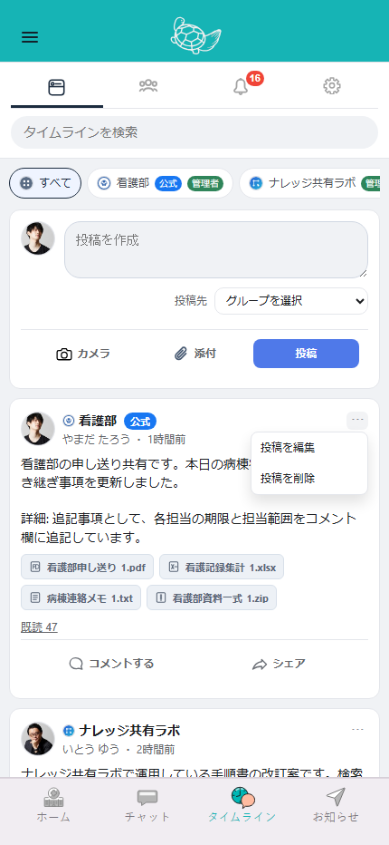

### 3. メディアプレビュー

起点: 投稿カード -> 画像/動画

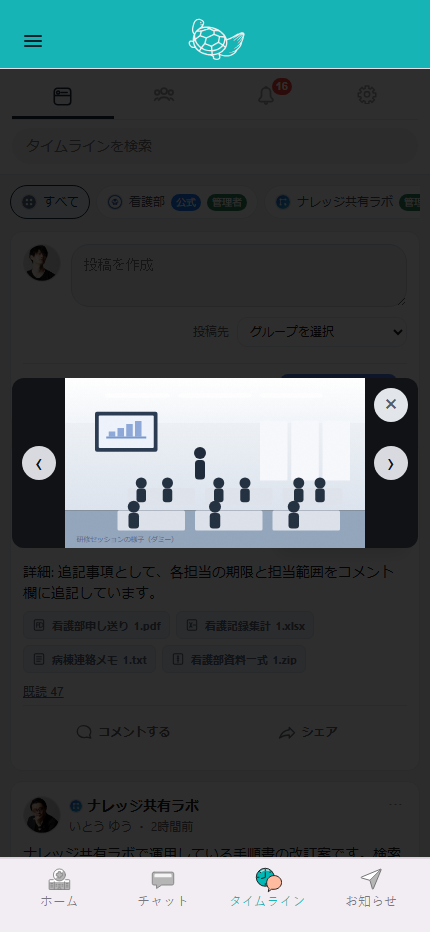

### 4. 既読者モーダル

起点: 投稿カード -> 既読人数

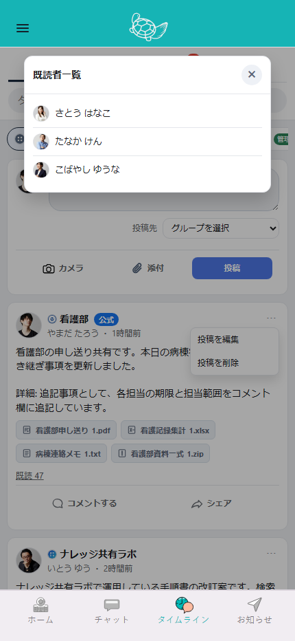

### 5. コメントビュー

起点: 投稿カード -> コメント


### 6. コメントヘッダーメニュー

起点: コメントビュー -> ヘッダーメニュー

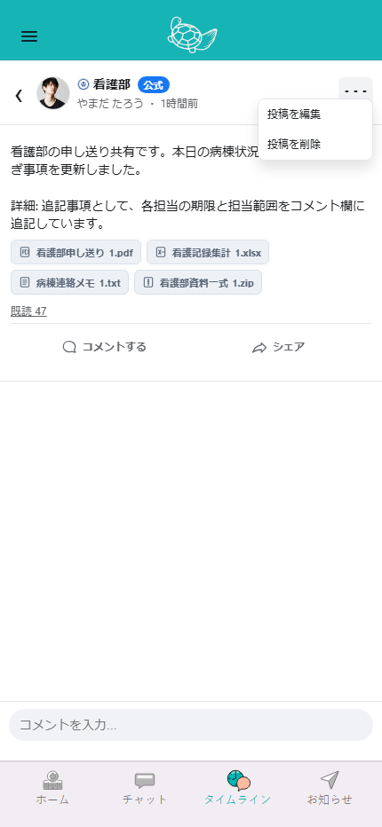

### 7. コメントアクションシート

起点: コメント長押し

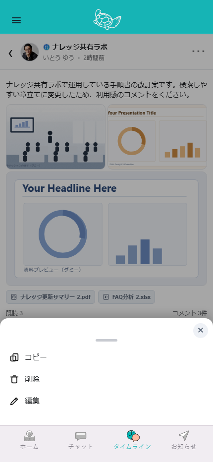

### 8. コメント編集中

起点: コメントアクションシート -> 編集

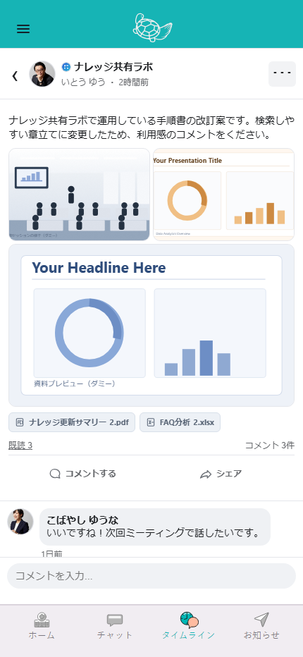

### 9. グループ一覧

起点: 上部タブ -> グループ

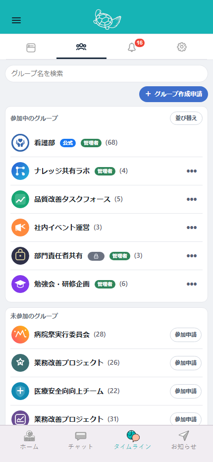

### 10. グループ詳細モーダル

起点: グループ一覧 -> グループ行


### 11. グループ行メニュー

起点: グループ一覧 -> ･･･

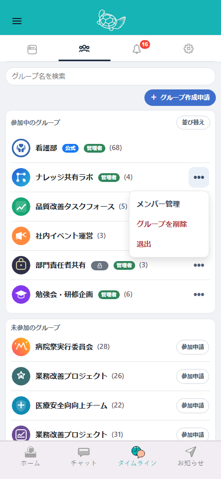

### 12. メンバー管理モーダル

起点: グループ一覧 -> メンバー管理


### 13. 招待申請モーダル

起点: グループ一覧 -> 招待


### 14. グループ作成申請モーダル

起点: グループ一覧 -> グループ作成


### 15. 通知ビュー

起点: 上部タブ -> 通知


### 16. 管理者向け通知ビュー

起点: 通知 -> 管理者向け通知タブ

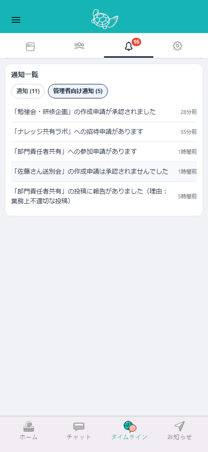

### 17. 設定ビュー

起点: 上部タブ -> 設定

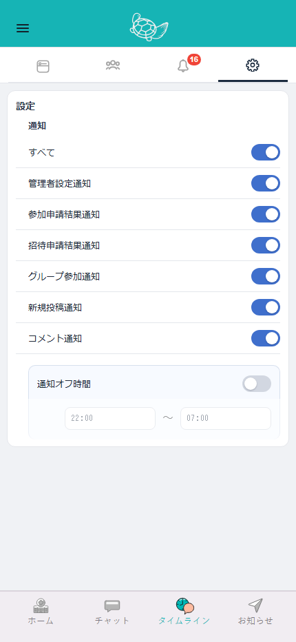

### 18. 報告理由モーダル

起点: 投稿/コメント -> 通報


### 19. お知らせダイアログ

起点: `showAlert` 系

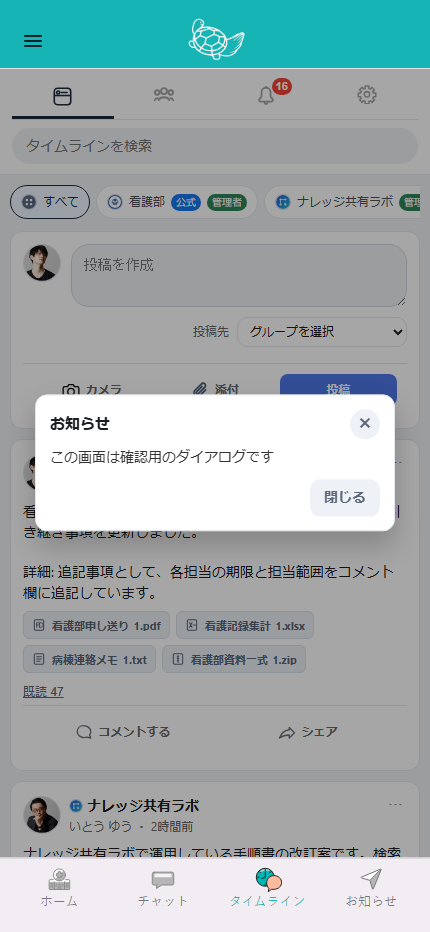

### 20. 確認ダイアログ

起点: `showConfirm` 系

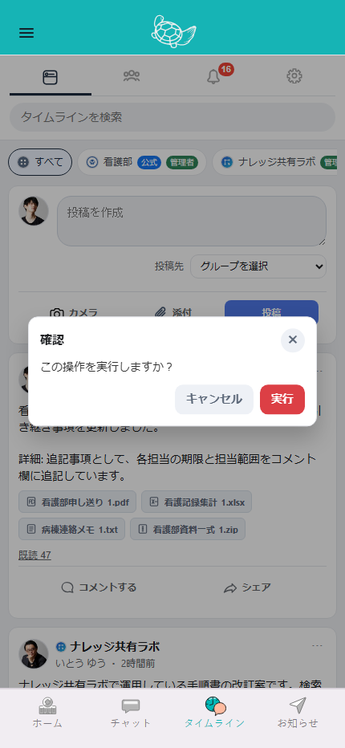

### 21. 投稿編集ダイアログ

起点: 投稿メニュー -> 編集

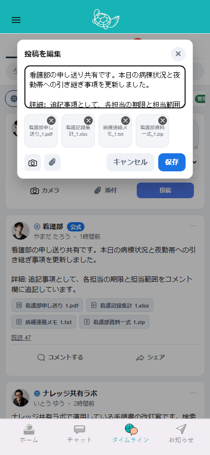

### 22. シェア投稿ダイアログ

起点: 投稿カード -> シェア

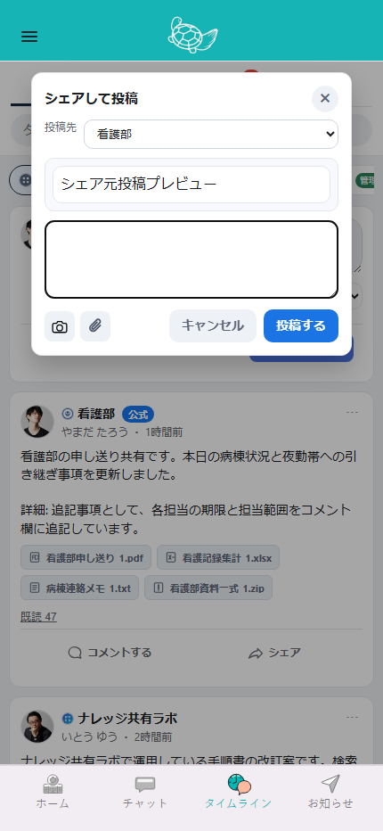

### 23. 管理者向け報告一覧モーダル

起点: 通知 or 管理導線 -> 報告一覧


### 24. ヘッダーバージョンポップアップ

起点: ヘッダー -> ロゴ長押し

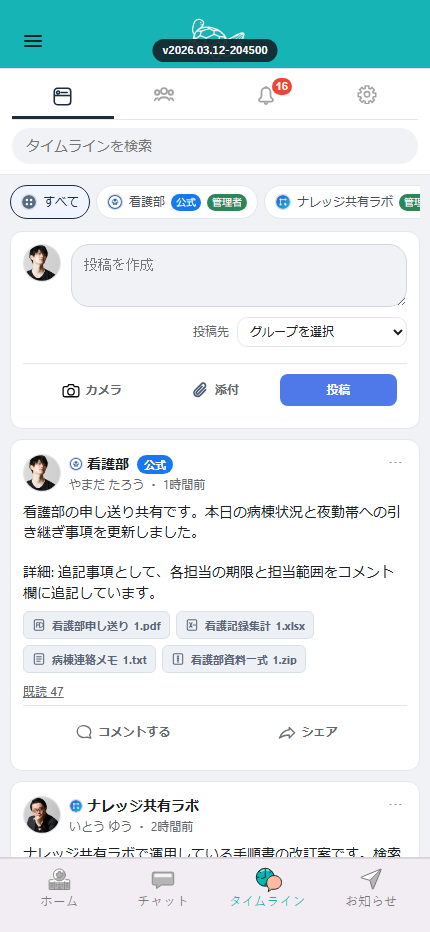

## 再生成

ローカルで HTTP サーバーを立てた状態で次を実行すると再生成できます。

```powershell
npm run capture:mock-flows
```
