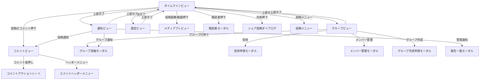
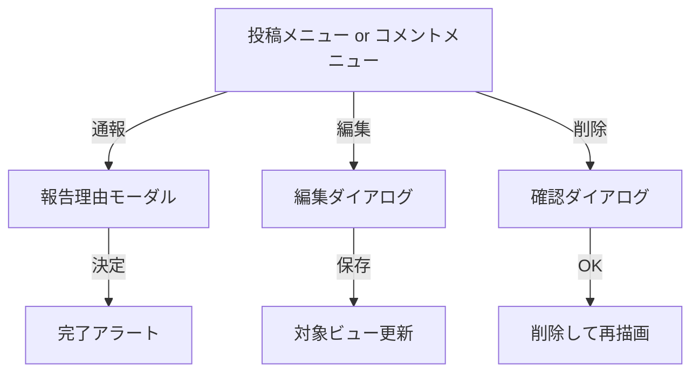
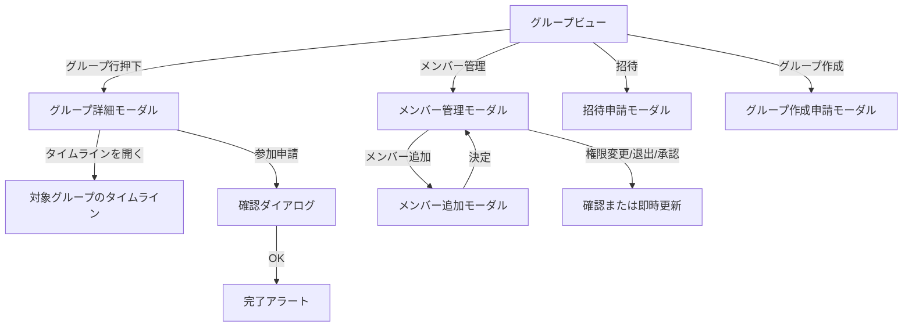

# Mock Flow Map

`src/moock-timeline.html` の UI フロー整理。

このモックは「ページ遷移型」ではなく、`単一画面 + タブ切替 + オーバーレイ` 型です。  
つまり把握すべきなのは URL 遷移ではなく、`どの操作でどの状態/ポップアップが開くか` です。

## 1. 画面パターン

### 常設ビュー

- タイムラインビュー
- グループビュー
- 通知ビュー
- 設定ビュー

### オーバーレイ/ポップアップ

- コメントビュー
- コメントアクションシート
- 投稿既読者モーダル
- 招待申請/メンバー追加モーダル
- グループ詳細モーダル
- メンバー管理モーダル
- 管理者向け報告一覧モーダル
- グループ作成申請モーダル
- 報告理由モーダル
- メディアプレビュー
- 汎用アプリダイアログ
  - Alert
  - Confirm
  - Prompt
  - 投稿編集
  - シェア投稿

### 小さい一時 UI

- 投稿メニュー
- コメントヘッダーメニュー
- グループ行メニュー
- ヘッダーのバージョンポップアップ

## 2. 主要フロー

### A. ベース画面

- 上部タブ押下
  - タイムラインビュー / グループビュー / 通知ビュー / 設定ビュー を切替
- タイムライン内フィードタブ押下
  - 投稿対象グループを切替

### B. 投稿起点

- 投稿のコメントボタン or コメント件数押下
  - コメントビューを開く
- 投稿の共有ボタン or シェア件数押下
  - シェア投稿ダイアログを開く
  - 投稿完了後、対象グループのタイムラインへ移動
- 投稿の既読者数押下
  - 既読者モーダルを開く
- 投稿画像/動画押下
  - メディアプレビューを開く
- 投稿メニューボタン押下
  - 投稿メニューを開く

### C. 投稿メニューからの分岐

- 投稿メニュー -> 通報
  - 報告理由モーダル
  - 完了アラート
- 投稿メニュー -> 編集
  - 投稿編集ダイアログ
- 投稿メニュー -> 削除
  - 削除確認ダイアログ
  - 実行後はタイムライン再描画

### D. コメントビュー起点

- コメントビューを開く
  - 戻るボタン / スワイプ / 親からの `mock-close-comment-view`
  - コメントビューを閉じる
- コメント長押し
  - コメントアクションシートを開く
- コメントアクションシート -> コピー
  - シートを閉じる
- コメントアクションシート -> 通報
  - 報告理由モーダル
  - 完了アラート
- コメントアクションシート -> 編集
  - コメント行がインライン編集状態になる
- コメントアクションシート -> 削除
  - 削除確認ダイアログ
- コメントヘッダーメニュー
  - 投稿通報 -> 報告理由モーダル -> 完了アラート
  - 投稿編集 -> 投稿編集ダイアログ
  - 投稿削除 -> 削除確認ダイアログ -> コメントビューを閉じる

### E. グループビュー起点

- グループ一覧行押下
  - グループ詳細モーダル
- グループ行メニュー -> 招待
  - 招待申請モーダル
  - 完了アラート
- グループ行メニュー -> メンバー管理
  - メンバー管理モーダル
- グループ行メニュー -> 参加申請
  - 確認ダイアログ
- グループ行メニュー -> 退出
  - 確認ダイアログ
- グループ行メニュー -> 削除
  - 確認ダイアログ
- グループ作成ボタン
  - グループ作成申請モーダル
  - 完了アラート

### F. グループ詳細モーダル起点

- タイムラインを開く
  - モーダルを閉じて対象グループのタイムラインへ
- 参加申請する
  - 確認ダイアログ
  - 完了アラート

### G. メンバー管理モーダル起点

- メンバー追加
  - メンバー追加モーダル
  - 完了アラート
  - メンバー管理モーダル再表示
- 管理者付与/解除
  - 必要に応じて確認ダイアログ
- メンバー退出
  - 確認ダイアログ
- 参加申請 承認/拒否
  - モーダル内状態更新
- 招待申請 承認/拒否
  - モーダル内状態更新

### H. 通知ビュー起点

- 通知 -> 投稿を開く
  - タイムラインへ切替
  - 対象投稿のコメントビューを開く
- 通知 -> グループを開く
  - グループビューへ切替
  - グループ詳細モーダルを開く
- 通知 -> グループ詳細を開く
  - 管理者ならグループ詳細モーダル
  - 非管理者なら対象グループのタイムラインへ
- 通知 -> グループのタイムラインを開く
  - タイムラインへ切替
  - 必要なら該当投稿までスクロール
- 通知 -> 管理対象の報告を開く
  - 管理者向け報告一覧モーダル
- 通知 -> dismiss
  - 通知だけ閉じる

## 3. Mermaid

### 全体像

### 通報/編集/削除系

### グループ管理系

## 4. まず把握すべき優先順

- ベースは `タイムライン / グループ / 通知 / 設定` の4ビュー
- 深い導線は `コメントビュー` と `グループ詳細モーダル`
- 管理者系の分岐は `メンバー管理モーダル` と `報告一覧モーダル`
- 汎用ダイアログは `通報 / 確認 / 編集 / シェア` に再利用されている

## 5. 次にやるとよい整理

- 操作起点ごとの一覧表を作る
  - 例: 「投稿カード」「コメントビュー」「グループ一覧」「通知一覧」
- 管理者/一般ユーザーで分けた図を作る
- 実装コード上の関数名対応表を付ける
  - 例: `openGroupDetailModal`, `openManageUsersModal`, `openReportReasonModal`
